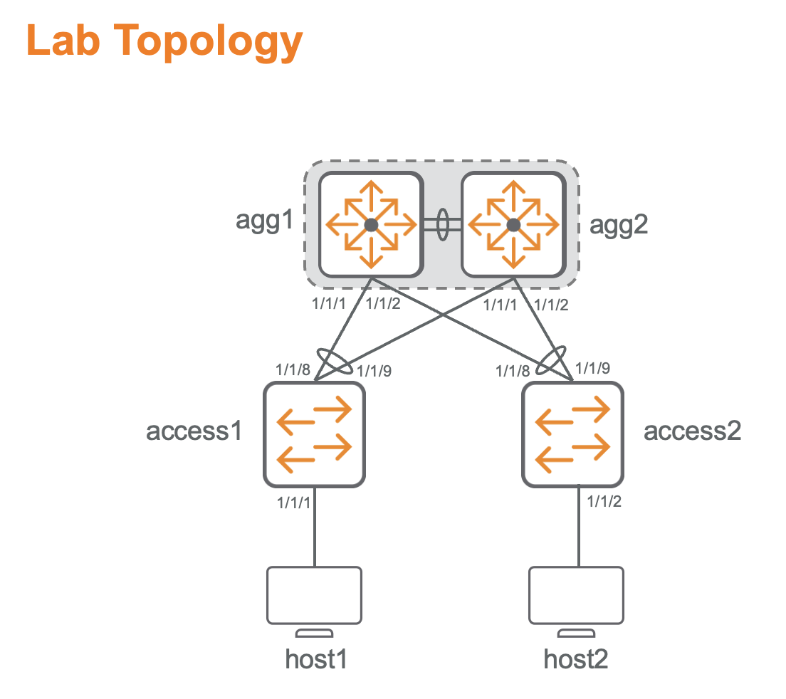
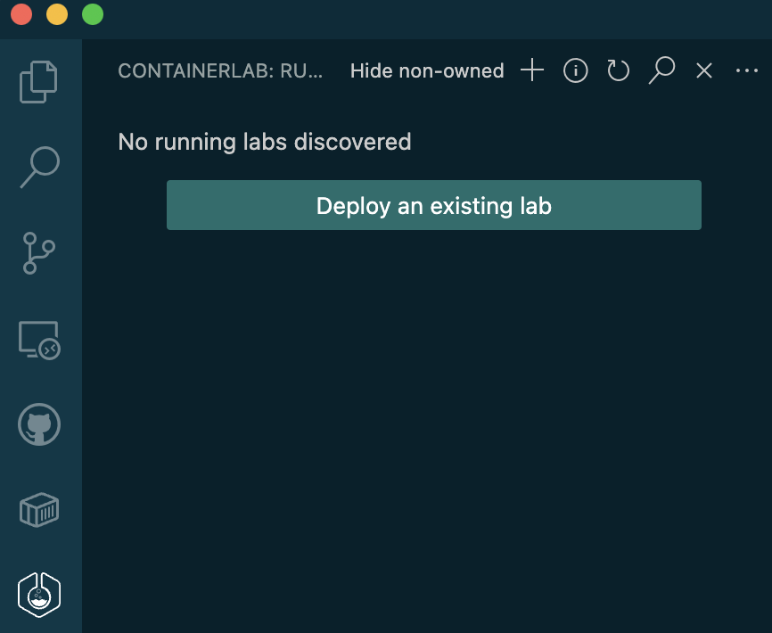
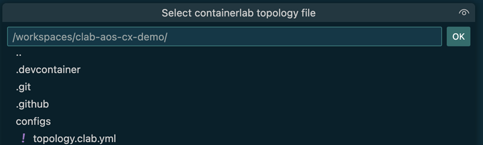
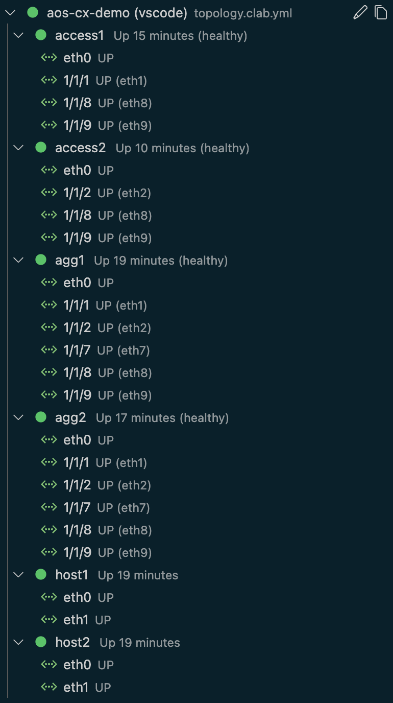
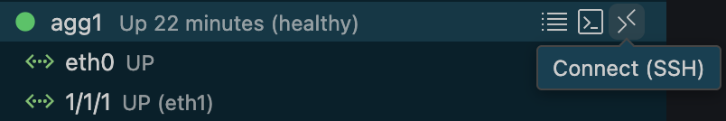
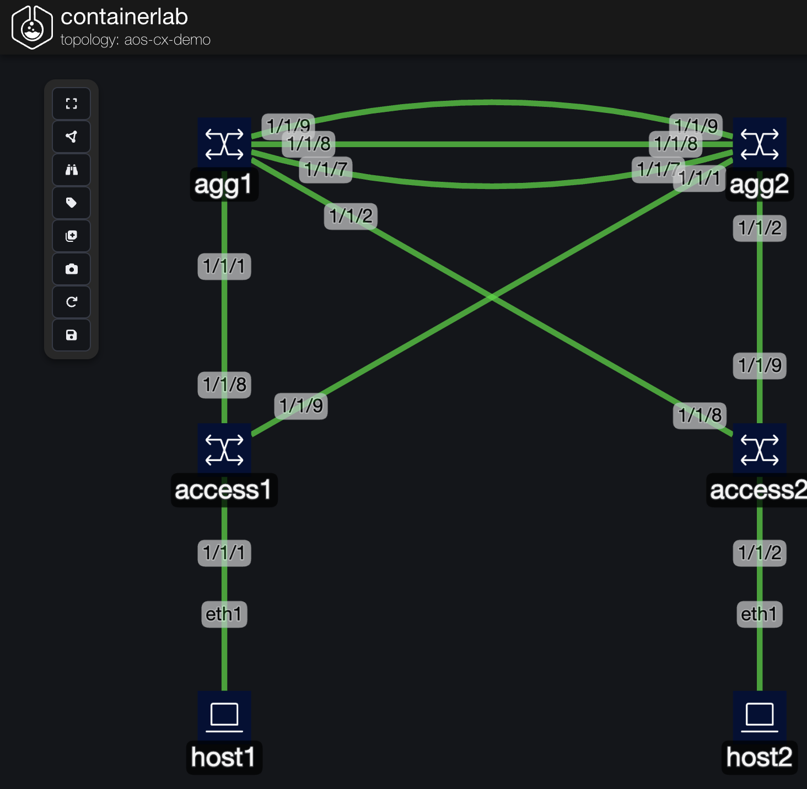
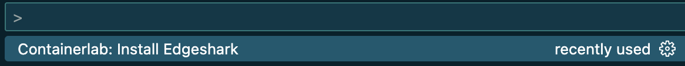
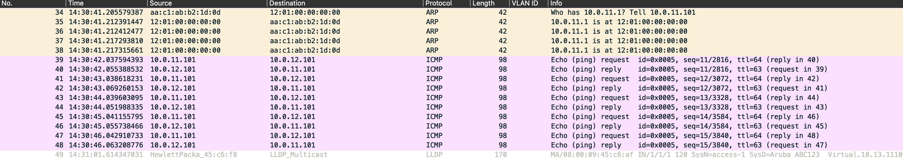
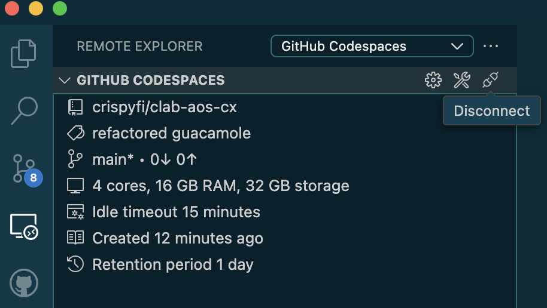
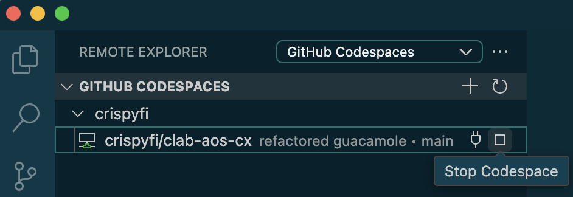

# clab-aos-cx-demo

## Overview

This is a simple lab to demonstrate using the HPE Aruba Networking AOS-CX Switch Simulator in GitHub Codespaces, with the [Containerlab](https://containerlab.dev) Dev Container image.

Find out more about [Containerlab labs in Codespaces](https://containerlab.dev/manual/codespaces/)

This lab also uses the [Containerlab VS Code Extension](https://containerlab.dev/manual/vsc-extension/)

## Lab Topology

The lab topology consists of:
- A VSX pair
- Two access switches
- A host connected to each access switch, in separate VLANs

| Hostname | IP Address     | VLAN ID | Gateway   |
| -------- | -------------- | ------- | --------- |
| host1    | 10.0.11.101/24 | 11      | 10.0.11.1 |
| host2    | 10.0.12.101/24 | 12      | 10.0.12.1 |




## Pre-requisites

In order to use this lab, you'll need to create and host the container image for the AOS-CX Switch Simulator in a private GitHub Container Registry, since it is not publicly available.
This can be done using the forked vrnetlab project [hellt/vrnetlab](https://github.com/hellt/vrnetlab) to 'package' the AOS-CX image in a Docker container that can be run in containerlab.
Special thanks to [ljarasius](https://github.com/ljarasius) for recommending the GitHub Actions approach below. ❤️

1) Create your own [GitHub account](https://github.com/signup) if you don't have one
2) Fork[This repository](https://github.com/crispyfi/clab-aos-cx-demo)
3) Run the [Build & Push ArubaOS-CX Docker Image](.github/workflows/ova-to-docker.yml) Workflow.
   You will need to provide a URL for the AOS-CX Switch Simulator image you want to use.
   This URL can be obtained from https://networkingsupport.hpe.com when downloading the image in your browser.

4) Install VS Code on your local machine
5) Set your default editor to Visual Studio Code in [Codespaces Settings](https://github.com/settings/codespaces)

## Starting the lab

Click the button below to create a new Codespaces machine and open remotely using VS Code. If you don't have the GitHub CodeSpaces extension you'll be prompted to install it and authorize access to your GitHub account.

<div align=left markdown>
<a href="https://codespaces.new/crispyfi/clab-aos-cx-demo?quickstart=1">
</a>

**[Run](https://codespaces.new/crispyfi/clab-aos-cx?quickstart=1) this lab in GitHub Codespaces for free**.  
[Learn more](https://containerlab.dev/manual/codespaces) about Containerlab for Codespaces.  
<small>Machine type: 4 vCPU · 16 GB RAM</small>
</div>

## Interacting with the lab

### Starting nodes

Once the lab has launched, navigate to the Containerlab extension, and deploy the lab from the `topology.clab.yml` file:





The logs should show the image being pulled from ghcr.io:

```
[stderr] 03:31:42 INFO Pulling ghcr.io/crispyfi/arubaos-cx:latest Docker image
[stderr] 03:32:31 INFO Done pulling ghcr.io/crispyfi/arubaos-cx:latest
```

Finally, all running containers should be listed.
In my testing, this took around 20 mins for all nodes to reach a healthy state.

This could be improved by using bigger Codespaces machines, which would also allow you to build larger topologies with more nodes.

```
╭───────────────────────────────┬────────────────────────────────────┬────────────────────┬───────────────────╮
│              Name             │             Kind/Image             │        State       │   IPv4/6 Address  │
├───────────────────────────────┼────────────────────────────────────┼────────────────────┼───────────────────┤
│ clab-aos-cx-demo-access1      │ aruba_aoscx                        │ running            │ 172.20.20.6       │
│                               │ ghcr.io/crispyfi/arubaos-cx:latest │ (healthy)          │ 3fff:172:20:20::6 │
├───────────────────────────────┼────────────────────────────────────┼────────────────────┼───────────────────┤
│ clab-aos-cx-demo-access2      │ aruba_aoscx                        │ running            │ 172.20.20.7       │
│                               │ ghcr.io/crispyfi/arubaos-cx:latest │ (healthy)          │ 3fff:172:20:20::7 │
├───────────────────────────────┼────────────────────────────────────┼────────────────────┼───────────────────┤
│ clab-aos-cx-demo-agg1         │ aruba_aoscx                        │ running            │ 172.20.20.3       │
│                               │ ghcr.io/crispyfi/arubaos-cx:latest │ (healthy)          │ 3fff:172:20:20::3 │
├───────────────────────────────┼────────────────────────────────────┼────────────────────┼───────────────────┤
│ clab-aos-cx-demo-agg2         │ aruba_aoscx                        │ running            │ 172.20.20.5       │
│                               │ ghcr.io/crispyfi/arubaos-cx:latest │ (healthy)          │ 3fff:172:20:20::5 │
├───────────────────────────────┼────────────────────────────────────┼────────────────────┼───────────────────┤
│ clab-aos-cx-demo-host1        │ linux                              │ running            │ 172.20.20.4       │
│                               │ ghcr.io/hellt/network-multitool    │                    │ 3fff:172:20:20::4 │
├───────────────────────────────┼────────────────────────────────────┼────────────────────┼───────────────────┤
│ clab-aos-cx-demo-host2        │ linux                              │ running            │ 172.20.20.2       │
│                               │ ghcr.io/hellt/network-multitool    │                    │ 3fff:172:20:20::2 │
╰───────────────────────────────┴────────────────────────────────────┴────────────────────┴───────────────────╯
```




### Connecting to nodes

Once lab has started, you can connect to the CX switches using SSH (admin, admin) using the connect icon.




```
admin@clab-aos-cx-demo-agg1's password: 
Last login: 2025-07-08 03:33:41 from the console
User "admin" has logged in 1 time in the past 30 days
agg-1# show version
-----------------------------------------------------------------------------
ArubaOS-CX
(c) Copyright Hewlett Packard Enterprise Development LP
-----------------------------------------------------------------------------
Version      : Virtual.10.13.1110                                            
Build Date   :                                                               
Build ID     : ArubaOS-CX:Virtual.10.13.1110:40649b64b204:202506162315       
Build SHA    : 40649b64b2043235df776e64a158f0f58842c868                      
Hot Patches  :                                                               
Active Image :                               

Service OS Version :                               
BIOS Version       :   
```

Linux hosts can be accessed by attaching to the shell using the terminal icon.


```
/ # ifconfig eth1
eth1      Link encap:Ethernet  HWaddr AA:C1:AB:E6:00:72  
          inet addr:10.0.11.101  Bcast:0.0.0.0  Mask:255.255.255.0
          inet6 addr: fe80::a8c1:abff:fee6:72/64 Scope:Link
          UP BROADCAST RUNNING MULTICAST  MTU:9500  Metric:1
          RX packets:54 errors:0 dropped:22 overruns:0 frame:0
          TX packets:11 errors:0 dropped:0 overruns:0 carrier:0
          collisions:0 txqueuelen:0 
          RX bytes:5768 (5.6 KiB)  TX bytes:866 (866.0 B)

/ # ping 10.0.12.101
PING 10.0.12.101 (10.0.12.101) 56(84) bytes of data.
64 bytes from 10.0.12.101: icmp_seq=1 ttl=63 time=198 ms
64 bytes from 10.0.12.101: icmp_seq=2 ttl=63 time=86.1 ms
64 bytes from 10.0.12.101: icmp_seq=3 ttl=63 time=116 ms
64 bytes from 10.0.12.101: icmp_seq=4 ttl=63 time=57.9 ms
64 bytes from 10.0.12.101: icmp_seq=5 ttl=63 time=165 ms
```

### TopoViewer

You can view and edit the topology graph by right-clicking on the topology name and clicking `Graph(TopoViewer)`:



### Packet Capture

You can also launch Wireshark to take a live packet capture for any link in the topology.

This requires an external capture plugin to be installed first. Steps are provided for your chosen OS [here](https://containerlab.dev/manual/wireshark/#wireshark-and-system-configuration)).

You'll also need to install the Edgeshark extension by using the built-in command provided by the Containerlab Dev Container image:



Once installed, you can right-click on a link and select 'Capture interface (Edgeshark)' to launch a capture in Wireshark.



### Stopping the lab

Once you've finished, you can right-click on the topology file name at the top of the tree and select `Destroy (cleanup)` to destroy all running containers and associated files.

If you've made changes to your topology, config files or TopoViewer graph, Commit and Sync the changes using Source Control in VS Code.

Read this [intro to git](https://code.visualstudio.com/docs/sourcecontrol/intro-to-git) for a quick primer on working with Git in VS Code.

You can disconnect, stop, delete or reconnect to the current Codespace using the GitHub Codespaces extension, or from [GitHub Codespaces](https://github.com/codespaces).






---

## Changing the topology

The entire topology is defined in the [topology.clab.yml](topology.clab.yml) file.

### Kinds

Kinds are used to define the types of nodes to be deployed.
The `aruba_aoscx` kind uses the image stored in your private GitHub Container Registry.
The image tag can be changed from `latest` to a specific version tag, based on the images you've created.

We also use the public `hellt/network-multitool` image kind as `linux` hosts for testing connectivity inside the lab.

```
  kinds:
    aruba_aoscx:
      type: aruba_aoscx
      image: ghcr.io/$GITHUB_USER/arubaos-cx:latest
    linux:
      image: ghcr.io/hellt/network-multitool
```

### Config

#### aruba_aoscx

Persistent configuration can be stored in a file for each node in the [configs](configs) directory.

Unlike specifying a startup config file for a regular CX switch, all commands in the file are loaded after boot, so the configuration order is especially important (e.g. OSPF areas must be defined before they are referenced).

The config files are not automatically updated, so if you want your changes to persist the next time you spin up the lab, you need to copy them to the corresponding config file in the repository. 

Don't forget to commit and sync your changes to GitHub!

```
    agg2:
      kind: aruba_aoscx
      startup-config: configs/agg2-config.txt
```

#### linux

Linux host IP addressing can be configured using a shell script called after boot.

```
    host1:
      kind: linux
      binds:
        - configs/host1.sh:/host1.sh
      exec:
        - bash /host1.sh
```


```
#!/bin/sh
ip addr add 10.0.10.101/24 dev eth1
ip route add default via 10.0.10.1 dev eth1
```


### Startup Order

`stages` can be used to stagger the startup order of nodes to avoid overloading the Dev Container CPU, and get the lab up and running faster without issues.

```
     stages:
        create:
          wait-for:
            - node: agg1
              stage: healthy
```

### Connectivity

Connectivity between nodes can be defined as node and interface pairs.

Although interfaces `1/1/1-1/1/10` are available in the AOS-CX Simulator, I found that the interface mapping got messed up if I tried to reference `1/1/10` in the `links` section.

```
  links:
  - endpoints: ["agg1:1/1/9", "agg2:1/1/9"]
  - endpoints: ["agg1:1/1/1", "access1:1/1/8"]
  - endpoints: ["access1:1/1/1", "host1:eth1"]
```

### Topology

If you use the TopoViewer function in the VS Code Extension and edit/save the node positions, they will be saved to the topology file.

This is also where to specify the icon shown for each node.

```
      labels:
        graph-icon: switch
        graph-posX: "635"
        graph-posY: "255"
        graph-groupLabelPos: bottom-center
```
---

### AOS-CX Switch Simulator - Feature Caveats

For quick reference, I've listed the features that may be configuration but will be _non-functional_ in the AOS-CX Switch Simulator.
As always, check the release notes for the version you are using for more specific details.

- CoPP
- Link detection (link is always on)
- Classifier policy
- ECMP
- MAC ACLs
- QoS
- ADC (NAE)
- UDLD
- Mirroring
- ERPS
- Firmware upgrade
- DCBx
- PBR
- VXLAN support with L3 VTEPs
- VXLAN support with VSX
- UBT
- VSF
- VLAN translation
- Watchdog
- PBT
- MAC Lockdown/Lockout
- Captive Portal

---
